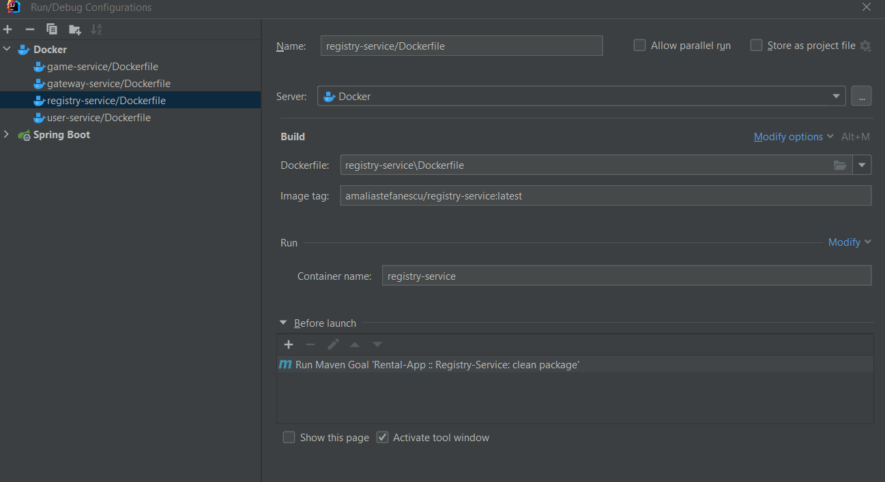

Introduction
------------

Backend app for 2023 dissertation thesis, done by Amalia Stefanescu.
 
This is the backend application for BIG-O , a simulated game rental platform.
The application is implemented using microservices and Spring Cloud.
It contains:

- 2 business microservices: `game-service` and `user-service`, that communicate using OpenFeign
- a registry service (eureka), where any registry service client gets an unique name 
- a discovery service (spring-cloud-discovery), that merges the APIs of all registry service clients under one host

Running locally
---------------

Make sure Java 8 is installed.
In IntelliJ, it's enough to create a runtime configuration for each executable class.
Make sure to set the active profile as `dev`.
It's recommended to start the apps in the following order (server, then clients):
* registry-service
* user-service
* game-service
* gateway-service

Deploying to Azure Portal
------------------------

Create a Docker config in intellij, based on the following template of registry-service

 
Using Docker Desktop, push the resulting image(s) into Docker Hub.
 
Restart (or create from scratch) the Container Instance config in Azure Portal, that has the prefix "ci-" .
