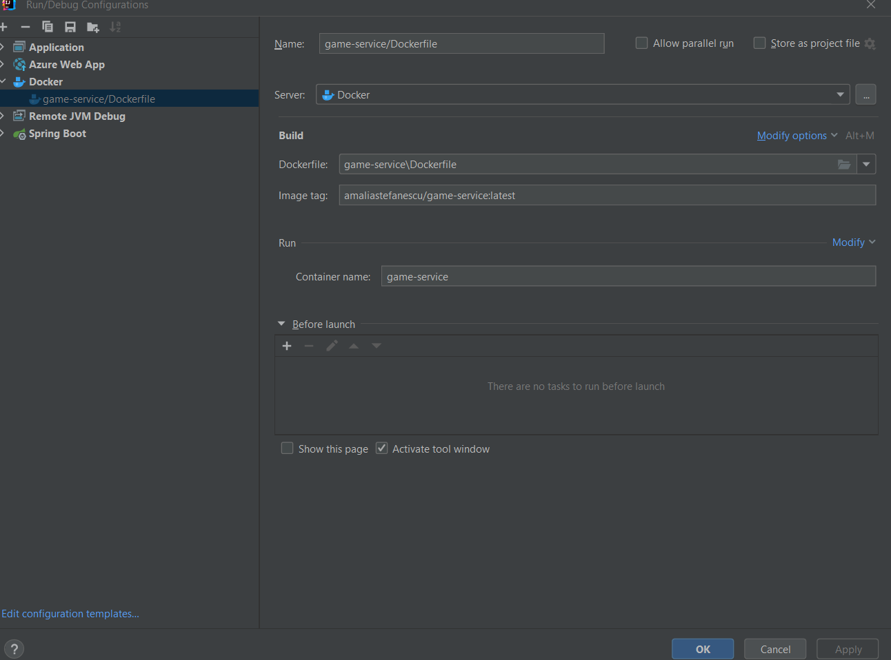

# Build and push docker image

## Prerequisites

* Docker Desktop is started
* User amaliastefanescu is authenticated in Docker Desktop
* A repository called "game-service" exists in hub.docker.com

## Steps

* Create a Docker Build configuration from the Dockerfile
* Set the image tag as amaliastefanescu/game-service:latest

* In Docker Desktop, find the image and push it to Docker Hub

## TODOs

* add a maven azure plugin to directly deploy the app in azure 
* create profile property files for local and azure setup